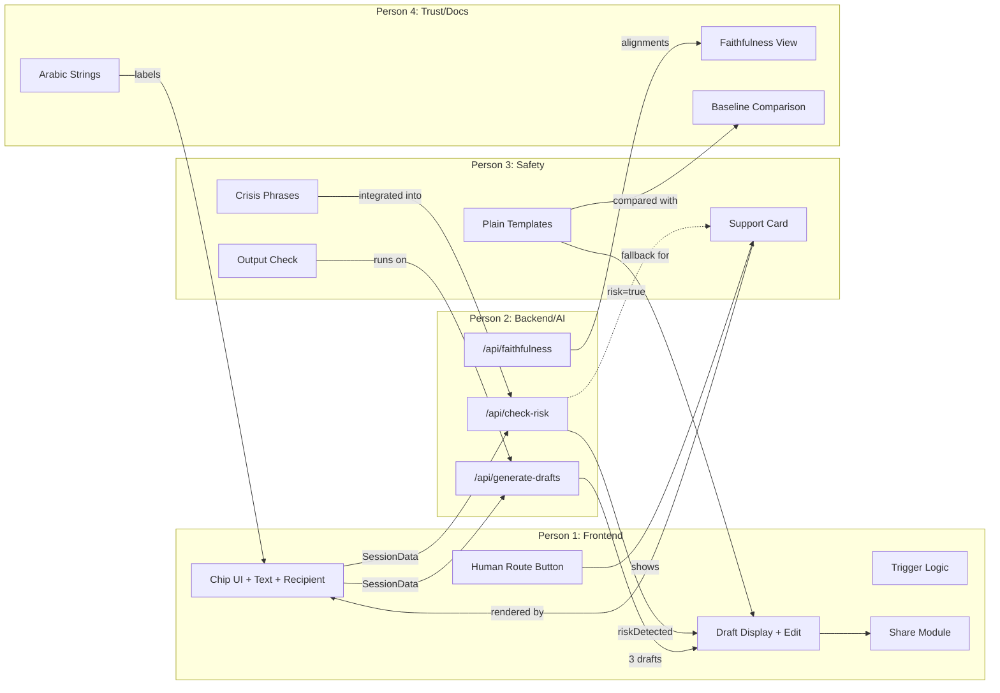

# Jisr (جِسر) — Master Implementation Plan

> **Source of truth**: [Bridge_Note_Product_Definition.pdf](Bridge_Note_Product_Definition.pdf) (in this folder)
> **Deadline**: Wednesday 7 October 2026, 11:50 PM
> **Presentation**: Thursday 8 October 2026, after noon prayer (~5 min + ~5 min Q&A, online)
> **Team size**: 4 people
> **Time budget**: Less than one day

---

## 1. Project Workflow Summary

### Core Problem
Young people in Libya experiencing everyday stress (exams, family, work, relationships, sleep, money) stay silent because writing the first sentence to ask for help is too hard — due to stigma, emotional overwhelm, and articulation cost. Silence delays help-seeking.

### Intended Users
A young person in Libya (student or young adult, possibly under 18) who is under everyday pressure and would benefit from telling someone, but cannot start. The **recipient** is a person already in their life (friend, sibling, parent, trusted adult, counsellor/teacher) — the recipient never uses the product.

### Main Objective
Break the silence by removing the friction of starting the conversation. Get the user from silence to a message they are willing to send to a real human, early, on their own terms. Then get out of the way.

### Expected Input
- **Chip selections** (exams / family / work / relationships / sleep / money / other) — the minimum viable input
- **Optional free text** (1–3 lines, Arabic / Libyan dialect / mixed Arabic-English / Latin-letter Arabic)
- **Recipient choice** (friend / sibling / parent / trusted adult / counsellor or teacher)
- **Tone choice** (gentle / direct / formal)

### Expected Output
- **Three tone-adapted drafts** of the user's message, each traceable to their own words
- **An editable final message** the user shares via their own messaging app
- **A support card** (shown if risk detected, always available via persistent human-route button)

### End-to-End Workflow (from the document §5)

```
S1 Problem → S2 User → S3 Interaction (chips + text + recipient)
  → S4 Observation (only what user provides)
  → S5 Private on-device record (optional, chip history)
  → S6 Writing trigger (same-session or pattern-based invitation)
  → S7 Writing experience (risk check → drafting → editing → sharing)
  → S8 Intended outcome (user sends a message to a real person)
```

### AI Components (§4.4 — exactly four AI functions)
1. **Structures messy free text** into a sendable message
2. **Adapts tone** for the audience (gentle / direct / formal × recipient type)
3. **Verifies faithfulness** — aligns generated phrases back to user input
4. **Classifies risk** — model-based crisis detection on Arabic natural language

### Non-AI Components (deliberately deterministic)
- Chip capture & recipient selector
- Private on-device record (chip history)
- Writing trigger question selection (simple counting)
- Fixed support card (static, never generated)
- Persistent human-route button
- Output check (deterministic filter on drafts)
- Identifier removal (pattern-based + user preview)

### Mandatory Deliverables (§22)
1. Complete source code in a GitHub repository
2. `README.md` (architecture, requirements, setup, usage)
3. Detailed technical report in Markdown (separate file)
4. Pitch deck or demo video inside the repository
5. Citation of every tool, model, and service used

### Tiering (§20 — what to cut when behind)
| Tier | Contents | Rule |
|------|----------|------|
| **Core — never cut** | Chip capture, recipient choice, free-text writing, 3-tone drafts, Guardian Layer (risk check + support card + output check), persistent human route, same-session trigger, sharing, nothing retained, stated limits, AI disclosure | Never cut |
| **Core extension** | Private on-device record, pattern trigger | Build if core is stable |
| **Trust views** | Baseline comparison, faithfulness view, outbound preview | In order of demo value/hour |
| **Optional** | Private written notes, extra tones/recipients, extra languages | First to cut |

**Cut order**: Optional → pattern record → baseline comparison → faithfulness view. Guardian Layer and human route are **never cut**.

---

## 2. End-to-End Pipeline

### Stage 1 — Capture Layer

| Item | Detail |
|------|--------|
| **Name** | Chip Capture & Recipient Selection |
| **Purpose** | Collect the user's situation and audience with minimal effort |
| **Input** | User taps on the UI |
| **Processing** | Store selected chips in session state; store optional free-text; store recipient + tone choice |
| **Output** | `SessionData { chips: string[], freeText?: string, recipient: string, tone?: string }` |
| **Technology** | Mobile application (React Native with Expo or Flutter — implementation decision IC1; matches mobile phone use in Libya, native sharing, and sandboxed storage) |
| **Dependencies** | None — this is the entry point |
| **Connection to next** | Output feeds into Stage 2 (Writing Trigger) and Stage 4 (Guardian Layer) |
| **Independent test** | Render the UI; tap chips; verify session object is correct; test RTL layout; test with zero typing |
| **Done when** | A user can tap chips, optionally type text, choose a recipient, and the session data object is correctly formed |

### Stage 2 — Private On-Device Record (Core Extension)

| Item | Detail |
|------|--------|
| **Name** | On-Device Chip History |
| **Purpose** | Remember recurring chip selections locally to enable the pattern trigger |
| **Input** | `SessionData.chips` + timestamp |
| **Processing** | Append to sandboxed storage (`AsyncStorage` / `SecureStore`); enforce retention window; support one-action delete |
| **Output** | `ChipHistory { entries: { chip: string, timestamp: Date }[] }` |
| **Technology** | Sandboxed mobile storage (`AsyncStorage` / `expo-secure-store` or Flutter `shared_preferences`) |
| **Dependencies** | Stage 1 (Capture Layer) |
| **Connection to next** | Feeds Stage 3 (Pattern Trigger) |
| **Independent test** | Write entries; read back; verify expiry; verify delete-all; verify nothing is transmitted (network tab) |
| **Done when** | Chip history persists across sessions on-device, expires correctly, deletes in one action, and no network requests are made for it |

### Stage 3 — Writing Trigger

| Item | Detail |
|------|--------|
| **Name** | Writing Invitation (Same-Session + Pattern) |
| **Purpose** | Gently invite the user to write a note, connecting their taps to the writing experience |
| **Input** | Current session chips (same-session) OR chip history (pattern) |
| **Processing** | **Same-session**: immediately after chip selection, show invitation using the selected chip name. **Pattern**: count recurring chips in history; if threshold met, show pattern-specific invitation. Simple counting logic, not AI. |
| **Output** | A UI prompt: e.g. "You picked exams. Want help writing a short note to someone about it?" |
| **Technology** | Frontend logic; a small fixed set of pre-written Arabic invitation strings (one per chip theme) |
| **Dependencies** | Stage 1 (same-session); Stage 2 (pattern trigger) |
| **Connection to next** | If user accepts → Stage 4. If user declines → do not repeat immediately |
| **Independent test** | Select chips → verify correct invitation appears; decline → verify no re-prompt; simulate repeat chips → verify pattern invitation |
| **Done when** | Both trigger types work; wording is reviewed by native Arabic speaker; decline is respected |

### Stage 4 — Guardian Layer (Pre-Drafting Risk Check)

| Item | Detail |
|------|--------|
| **Name** | Risk Classification & Safety Gate |
| **Purpose** | Check user text for crisis indicators before any drafting occurs |
| **Input** | `SessionData.freeText` (the 1–3 lines the user typed) |
| **Processing** | **Layer A**: Team-maintained keyword/phrase list (Arabic + Libyan dialect crisis phrases). **Layer B**: LLM-based classification prompt ("Does this text indicate the person is in crisis?"). Both run; if either triggers → show support card, skip drafting. High-recall tuning: over-trigger rather than miss. |
| **Output** | `{ riskDetected: boolean, method: 'phrase'|'model'|'both' }` |
| **Technology** | JavaScript phrase matching + LLM API call (same model service used for drafting) |
| **Dependencies** | Stage 1 (user text); the crisis phrase list; the LLM API key/access |
| **Connection to next** | If `riskDetected=true` → Stage 5 (Support Card). If `riskDetected=false` → Stage 6 (Identifier Removal → Drafting) |
| **Independent test** | Run against a test set of Arabic crisis phrases (including dialect, euphemisms, mixed script) and measure recall + false-alarm rate. Target: recall as high as possible, accepting false alarms. |
| **Done when** | Recall and false-alarm rates are measured on the test set and reported with sample sizes; the phrase list has been reviewed by a native Arabic speaker |

### Stage 5 — Support Card

| Item | Detail |
|------|--------|
| **Name** | Fixed Support Card |
| **Purpose** | Show verified human-support contacts when risk is detected, or on demand |
| **Input** | Risk trigger OR user taps the persistent human-route button |
| **Processing** | Display a static, pre-written card. Text is never generated, never personalised by AI. |
| **Output** | A UI card with verified contacts and a "continue to note" option |
| **Technology** | Static HTML/component; no AI |
| **Dependencies** | Verified contact information (Q1 — must be verified by a named team member) |
| **Connection to next** | User may continue to Stage 6 after seeing the card, or stop |
| **Independent test** | Verify card displays correctly; verify all contacts are verified; verify card is reachable from every screen |
| **Done when** | Card is visible, contacts are verified (or card states "cannot display unconfirmed contact"), reachable from everywhere |

### Stage 6 — Identifier Removal & Outbound Preview

| Item | Detail |
|------|--------|
| **Name** | PII Stripping |
| **Purpose** | Remove personal identifiers before text leaves the device for drafting |
| **Input** | `SessionData.freeText` |
| **Processing** | Regex/pattern-based removal of names, phone numbers, emails. Replace with placeholders (`[name]`, `[number]`). Show the user what will be sent (outbound preview) for correction. |
| **Output** | `{ sanitisedText: string, identifiersFound: { original, placeholder }[] }` |
| **Technology** | Regex patterns (Arabic + Latin names, Libyan phone formats, emails); UI preview component |
| **Dependencies** | Stage 1 (user text) |
| **Connection to next** | Sanitised text feeds into Stage 7 (Drafting Engine) |
| **Independent test** | Test with Libyan names, phone numbers, email addresses, mixed-script text; verify removal; verify preview shows correct result |
| **Done when** | Common identifiers are removed; user can see and correct the sanitised text; misses are visible |

### Stage 7 — Drafting Engine (AI Core)

| Item | Detail |
|------|--------|
| **Name** | Tone-Adapted Draft Generation |
| **Purpose** | Transform user's words into 3 sendable drafts at 3 tones |
| **Input** | `{ sanitisedText, chips, recipient, tone: 'all three' }` |
| **Processing** | LLM API call with a carefully crafted system prompt that enforces: (a) 3 tones (gentle, direct, formal), (b) adapted to recipient type, (c) based only on user's words, (d) no diagnosis/clinical language/medication/invented facts, (e) Arabic output, (f) I-statements. |
| **Output** | `{ drafts: { tone: string, text: string }[3] }` |
| **Technology** | LLM API (e.g. Gemini API, OpenAI API, or similar — accessible from Libya per IC2) |
| **Dependencies** | Stage 6 (sanitised text); LLM API access; the system prompt |
| **Connection to next** | Output feeds into Stage 8 (Output Check) |
| **Independent test** | Send test inputs; verify 3 drafts returned; verify no clinical language; verify Arabic quality with native reviewer; verify drafts trace to user's words |
| **Done when** | Drafts are generated for all chip/recipient/tone combinations tested; no clinical language in output; Arabic quality accepted by native reviewer |

### Stage 8 — Output Check (Post-Drafting Safety)

| Item | Detail |
|------|--------|
| **Name** | Deterministic Draft Filter |
| **Purpose** | Block any draft containing forbidden content that the LLM generated despite instructions |
| **Input** | The 3 drafts from Stage 7 |
| **Processing** | Scan each draft for: condition names, diagnostic language, medication/dosage references, treatment plans, clinical advice. If found → regenerate once → if still blocked → replace with plain template. |
| **Output** | `{ drafts: { tone, text, wasFiltered }[3] }` |
| **Technology** | Keyword/pattern matching (a forbidden-terms list); plain template fallback |
| **Dependencies** | Stage 7 output; the forbidden-terms list; the plain template |
| **Connection to next** | Clean drafts feed into Stage 9 (User Editing & Trust Views) |
| **Independent test** | Inject forbidden content into drafts; verify it is caught and replaced |
| **Done when** | All forbidden categories are covered; blocked drafts are replaced with a usable template |

### Stage 9 — User Editing & Trust Views

| Item | Detail |
|------|--------|
| **Name** | Draft Editing, Faithfulness View, Baseline Comparison |
| **Purpose** | Let the user see, understand, and edit the AI's work |
| **Input** | The 3 filtered drafts + original user text |
| **Processing** | Display 3 drafts side-by-side or tabbed. **Faithfulness view** (trust view): highlight which phrases in the draft map to which user input phrases (via simple text-matching or LLM alignment call). **Baseline comparison**: show a plain template next to the AI draft. User edits the chosen draft. |
| **Output** | `{ finalDraft: string, toneChosen: string }` |
| **Technology** | Frontend components; optional LLM call for faithfulness alignment |
| **Dependencies** | Stage 8 (filtered drafts); the plain template; UI components |
| **Connection to next** | Final draft feeds into Stage 10 (Sharing) |
| **Independent test** | Verify 3 drafts display; verify editing works; verify faithfulness highlights are correct; verify baseline comparison renders |
| **Done when** | User can view, compare, and edit all 3 drafts; trust views render correctly for tested inputs |

### Stage 10 — Sharing

| Item | Detail |
|------|--------|
| **Name** | User-Controlled Message Sharing |
| **Purpose** | Let the user send the final note via their own messaging app |
| **Input** | `finalDraft` |
| **Processing** | Open the native mobile system share sheet (`Share.share()` in React Native or `share_plus` in Flutter) or copy-to-clipboard. Directly opens WhatsApp, Messenger, Telegram, or SMS. AI disclosure notice appended or shown. Nothing is tracked — no telemetry of whether/when/to whom the user shared. |
| **Output** | The text is in the user's messaging app (or clipboard) |
| **Technology** | Native Mobile Share Sheet (`Share.share()`) |
| **Dependencies** | Stage 9 (final draft) |
| **Connection to next** | End of product flow. Encourage user out. |
| **Independent test** | Verify native share sheet pops up on mobile device; verify clipboard copy works; verify no tracking/analytics |
| **Done when** | Sharing works on at least one target device; no network calls are made during sharing |

---

## 3. Four-Person Responsibility Breakdown

> [!IMPORTANT]
> The document (§20.3) explicitly suggests this split: **Capture & Trigger** / **Drafting** / **Guardian & Evidence** / **Trust, Documentation & Presentation**. This plan follows that structure with refinements for actual implementability.

---

### Person 1: Rayan — Frontend & Capture Engineer

**Primary responsibility:**
The entire user-facing interface, the capture layer (chips, text input, recipient selector), the writing trigger UI, the on-device record, and the sharing mechanism. Owns the visual/interaction shell that all other components plug into.

**Tasks:**
1. Set up the web application scaffold (e.g. React/Next.js or vanilla HTML/CSS/JS — team decides in Phase 0)
2. Implement the chip selection UI (exams / family / work / relationships / sleep / money / other) with RTL Arabic layout
3. Implement the free-text input box (1–3 lines, Arabic-ready, RTL)
4. Implement the recipient selector (friend / sibling / parent / trusted adult / counsellor or teacher)
5. Implement the same-session writing trigger (invitation prompt after chip selection)
6. Implement the on-device record using `localStorage`/`IndexedDB` (store chip + timestamp, enforce retention window, one-action delete, toggle on/off)
7. Implement the pattern trigger logic (count recurring chips, show pattern-specific invitation if threshold met)
8. Implement the sharing mechanism (Web Share API + clipboard fallback)
9. Implement the "Talk to Someone Now" persistent human-route button on every screen
10. Build the navigation flow: chips → trigger prompt → writing → drafts → editing → sharing → "encouraged out" screen
11. Ensure the entire UI is Arabic-first, RTL, mobile-responsive, and works on ordinary phones
12. Integrate placeholder/stub API calls for the drafting engine and risk check (to be replaced with Person 2's real endpoints)
13. Ensure no network calls are made for the on-device record (verify in browser dev tools)

**Deliverables:**
- The complete web application UI (`/src/app/` or equivalent)
- Chip component, text input component, recipient selector component
- Trigger invitation component (same-session + pattern)
- On-device record module (`/src/lib/record.ts` or equivalent)
- Share module (`/src/lib/share.ts`)
- Persistent human-route button component
- Navigation flow connecting all screens
- Mobile-responsive RTL CSS/styling

**Dependencies:**
- From Person 2: the API contract (request/response format) for the drafting engine and risk check
- From Person 3: the support card content (HTML/text for the fixed card) and the output check result format
- From Person 4: Arabic UI strings (labels, button text, invitation wording)

**Outputs to other members:**
- To Person 2: the exact `SessionData` JSON shape that will be sent to the API
- To Person 3: integration points (where the support card renders, where the output check result is consumed)
- To Person 4: a running UI that can be screenshotted/demoed for the pitch deck

**Testing responsibility:**
- All UI interactions work on mobile (at least one Android device)
- RTL layout renders correctly for Arabic text
- On-device record persists, expires, and deletes correctly
- No data leaves the device except the explicit drafting API call
- Sharing opens the device's share sheet or copies to clipboard

**Definition of done:**
A user can open the web app on a phone, tap chips, type text, pick a recipient, see a trigger invitation, accept it, and reach the drafting screen — all in Arabic, RTL, with the on-device record working and the persistent human-route button visible on every screen.

---

### Person 2: Muatz — AI Core & Backend Engineer (Drafting & Risk Check)

**Primary responsibility:**
The AI core: the drafting engine (LLM integration for 3-tone draft generation), the model-based risk classification, the identifier removal module, and the backend/API layer that Person 1's frontend calls.

**Tasks:**
1. Select and validate the LLM service (test accessibility from Libya, billing, data retention policies — RV1, RV2)
2. Build a lightweight backend API (or serverless functions) with two endpoints:
   - `POST /api/check-risk` — runs the model-based risk classification
   - `POST /api/generate-drafts` — runs identifier removal + drafting
3. Write the **risk-classification prompt** for the LLM (Arabic crisis detection, high-recall tuning)
4. Write the **drafting system prompt** enforcing: 3 tones (gentle/direct/formal), recipient adaptation, user-words-only, no clinical language, I-statements, Arabic output
5. Implement the **identifier removal** module (regex for Arabic/Libyan names, phone numbers, emails → placeholders)
6. Implement request/response handling: receive `SessionData` from frontend, return `{ riskDetected, drafts }` or `{ riskDetected, supportCard }`
7. Implement retry logic: if the LLM is unreachable, return a plain template fallback
8. Implement the **faithfulness alignment** (optional trust view): an LLM call that maps draft phrases back to user-input phrases, returning `{ alignments: { draftPhrase, inputPhrase }[] }`
9. Ensure nothing is stored on the server: no session logs, no user text, no drafts — stateless
10. Test Arabic/dialect quality with real inputs and native reviewer
11. Deploy the backend so it's accessible for the online demo (e.g. Vercel serverless, Railway, or similar)

**Deliverables:**
- Backend API code (`/api/check-risk.ts`, `/api/generate-drafts.ts`, `/api/faithfulness.ts`)
- Identifier removal module (`/src/lib/identifier-removal.ts`)
- LLM prompt files (`/prompts/risk-check.md`, `/prompts/drafting.md`, `/prompts/faithfulness.md`)
- API contract documentation (request/response schemas)
- Deployment configuration
- Test results: dialect quality assessment from native reviewer

**Dependencies:**
- From Person 1: the `SessionData` JSON contract (agreed in Phase 0)
- From Person 3: the crisis phrase list (for the layered risk check — Person 3 builds the phrase list, Person 2 integrates the model layer alongside it)
- From Person 4: Arabic prompt wording review
- External: LLM API key and confirmed access from Libya

**Outputs to other members:**
- To Person 1: the API endpoint URLs and the exact response JSON shapes
- To Person 3: the model-based risk check results on the test set (so Person 3 can measure combined recall)
- To Person 4: example API call/response pairs for the technical report

**Testing responsibility:**
- Drafting produces 3 tones, adapted to recipient, in Arabic
- Drafting does not generate clinical language, condition names, medication references
- Risk check achieves high recall on Person 3's test set
- Identifier removal catches common Libyan names, phone formats, emails
- API is stateless: no data persisted between requests
- API responds within acceptable latency for live demo

**Definition of done:**
The API accepts a session data payload, returns either a risk alert or 3 tone-adapted drafts, in Arabic, with no clinical language, traceable to user's words, and nothing stored. Deployed and accessible from a browser.

---

### Person 3: Shima — Safety, Guardian & Evidence Engineer

**Primary responsibility:**
The Guardian Layer's deterministic components: the Arabic crisis phrase list, the output check (post-drafting filter), the support card content, the safety test set, and all measured safety evidence (recall/false-alarm rates). Also owns the forbidden-terms list and the plain template fallback.

**Tasks:**
1. Build the **Arabic crisis phrase list** — including Libyan dialect, mixed Arabic/English, euphemistic phrasing, and Latin-letter Arabic crisis expressions. This is the phrase-matching layer of the risk check.
2. Write the **fixed support card** content — static text with verified contacts (or the fallback statement if no contacts can be verified). Coordinate with the team to verify at least one contact (Q1).
3. Build the **output check module** — a deterministic filter that scans AI-generated drafts for: condition names, diagnostic language, medication/dosage, treatment plans, clinical advice. Produces a pass/fail per draft.
4. Build the **forbidden-terms list** — the word/phrase list used by the output check.
5. Write the **plain template fallback** — 3 pre-written templates (gentle/direct/formal) used when drafts are blocked or the API fails.
6. Build the **safety test set** — a collection of Arabic text inputs (crisis, non-crisis, ambiguous, dialect, mixed-script) for measuring risk-check performance. **No real crisis text from any person** — all synthetic/team-written.
7. Run the combined risk check (phrase list + Person 2's model check) against the test set and **measure recall and false-alarm rates**.
8. Document all safety evidence with sample sizes.
9. Review the AI-generated drafts from Person 2's engine for safety violations.
10. Verify or disqualify support contacts (Q1).
11. Write the **stated limits** text shown in the UI ("Jisr is not a doctor, not a diagnosis tool…").

**Deliverables:**
- Crisis phrase list (`/safety/crisis-phrases.json` or similar)
- Forbidden-terms list (`/safety/forbidden-terms.json`)
- Output check module (`/src/lib/output-check.ts`)
- Support card content (`/safety/support-card.md` or HTML component)
- Plain template fallback (`/safety/plain-templates.json` — 3 templates × recipient types)
- Safety test set (`/safety/test-set.json` — labelled inputs with expected results)
- Safety evidence report (`/safety/evidence.md` — recall, false-alarm rates, sample sizes)
- Stated-limits text for the UI
- Contact verification record (who verified what, when)

**Dependencies:**
- From Person 2: the model-based risk check endpoint (to run combined evaluation)
- From Person 4: native Arabic review of the phrase list and support card wording
- External: a native Arabic reviewer (A5) — may be Person 4 or a reachable contact

**Outputs to other members:**
- To Person 1: the support card HTML/content to embed in the UI; the stated-limits text; the plain templates
- To Person 2: the crisis phrase list (for integration into the phrase-matching layer); the forbidden-terms list (for the output check if it runs server-side)
- To Person 4: the safety evidence report (recall/false-alarm figures) for the technical report and pitch deck

**Testing responsibility:**
- The phrase list catches crisis expressions in the test set
- The output check catches all forbidden categories in synthetic drafts
- Combined recall and false-alarm rates are measured and reported
- The support card is accurate and accessible
- The plain templates are usable and appropriate

**Definition of done:**
The crisis phrase list, output check, support card, plain templates, and safety test set exist. Recall and false-alarm rates are measured on the test set with sample sizes, and documented. Every contact on the support card is verified by name, or the fallback statement is used.

---

### Person 4: Mohamed Thabet (Team Leader) — Trust Views, Arabic Quality, Documentation & Presentation Lead

**Primary responsibility:**
The trust and control views (faithfulness view, baseline comparison), all Arabic language quality across the product, the technical report, the README, the pitch deck or demo video, and tool citations. The team's interface with the evaluators.

**Tasks:**
1. Build the **faithfulness view** UI component — highlights which parts of a draft came from the user's input (consumes alignment data from Person 2's faithfulness endpoint)
2. Build the **baseline comparison** UI component — shows the AI draft side by side with the plain template (from Person 3), so value is visible
3. Build the **outbound preview** component — shows the user exactly what would leave the device before drafting (the sanitised text from Person 2's identifier removal)
4. **Native Arabic review** of all user-facing strings: chip labels, invitation wording, support card text, stated limits, button labels, UI prompts
5. **Native Arabic review** of Person 3's crisis phrase list and safety test set
6. **Arabic quality review** of Person 2's AI-generated drafts (test with real inputs, rate dialect quality)
7. Write the **README.md** — project architecture, operational requirements, setup steps, usage instructions
8. Write the **detailed technical report** (`REPORT.md`) — rationale, safety approach, privacy design, evidence, AI functions, stated limits, measured figures
9. Create the **pitch deck** (~5 slides: problem, solution, what AI does, safety/privacy, demo + honest limits) OR record a **demo video**
10. Maintain the **tool citations list** — every model, API, framework, library used
11. Prepare answers for expected committee questions (§22.2): "How is this not a chatbot?", "Where does data go?", "What if AI writes something harmful?", "Does this diagnose?", "Why feasible in Libya?"
12. Write the **AI disclosure** text shown at every drafting step

**Deliverables:**
- Faithfulness view component (`/src/components/FaithfulnessView.*`)
- Baseline comparison component (`/src/components/BaselineComparison.*`)
- Outbound preview component (`/src/components/OutboundPreview.*`)
- All Arabic UI strings file (`/src/i18n/ar.json` or equivalent)
- `README.md` (root of repository)
- `REPORT.md` (root of repository)
- Pitch deck file or demo video (inside the repository)
- `CITATIONS.md` (tool/model/service citations)
- Committee Q&A preparation document
- AI disclosure text

**Dependencies:**
- From Person 2: the faithfulness alignment API response format; example API responses for the report
- From Person 3: the safety evidence figures for the report; the plain templates for baseline comparison; the support card text for review
- From Person 1: a running UI to screenshot/record for the pitch deck; the list of all UI strings that need Arabic text

**Outputs to other members:**
- To Person 1: all reviewed Arabic strings for the UI; the AI disclosure text
- To Person 2: reviewed/corrected Arabic prompt wording
- To Person 3: reviewed/corrected crisis phrase list and test set
- To all: the README and technical report for final review

**Testing responsibility:**
- Faithfulness view correctly highlights source phrases
- Baseline comparison correctly displays template vs. AI draft
- All Arabic text is natural, non-clinical, and appropriate (native review)
- README instructions actually work (someone can follow them to run the product)
- Technical report accurately reflects what was built

**Definition of done:**
Trust view components render correctly. All Arabic text has been reviewed. README, technical report, pitch deck, and citations file exist in the repository. The team can give the 5-minute presentation with prepared answers to expected questions.

---

## 4. Task Lists (Summary per Person)

### Person 1: Rayan — Frontend & Capture
| # | Task | Priority | Est. Hours |
|---|------|----------|------------|
| 1.1 | Project scaffold + deployment config | Core | 0.5 |
| 1.2 | Chip selection UI (RTL, Arabic) | Core | 1.0 |
| 1.3 | Free-text input (RTL, Arabic) | Core | 0.5 |
| 1.4 | Recipient selector | Core | 0.5 |
| 1.5 | Same-session trigger prompt | Core | 0.5 |
| 1.6 | Navigation flow (all screens) | Core | 1.5 |
| 1.7 | Draft display + editing screen | Core | 1.0 |
| 1.8 | Persistent human-route button | Core | 0.5 |
| 1.9 | Support card display (from Person 3) | Core | 0.5 |
| 1.10 | Sharing mechanism | Core | 0.5 |
| 1.11 | API integration (risk check + drafts) | Core | 1.0 |
| 1.12 | On-device record (localStorage) | Extension | 1.0 |
| 1.13 | Pattern trigger logic | Extension | 0.5 |
| 1.14 | Mobile testing + polish | Core | 1.0 |

### Person 2: Muatz — AI Core & Backend
| # | Task | Priority | Est. Hours |
|---|------|----------|------------|
| 2.1 | Validate LLM service access from Libya | Core | 0.5 |
| 2.2 | API scaffold + deployment | Core | 1.0 |
| 2.3 | Risk-check prompt + endpoint | Core | 1.5 |
| 2.4 | Drafting system prompt + endpoint | Core | 2.0 |
| 2.5 | Identifier removal module | Core | 1.0 |
| 2.6 | Retry/fallback logic | Core | 0.5 |
| 2.7 | Faithfulness alignment endpoint | Trust View | 1.5 |
| 2.8 | Arabic/dialect quality testing | Core | 1.0 |
| 2.9 | API statelessness verification | Core | 0.5 |
| 2.10 | Load/latency testing | Core | 0.5 |

### Person 3: Shima — Safety & Evidence
| # | Task | Priority | Est. Hours |
|---|------|----------|------------|
| 3.1 | Crisis phrase list (Arabic + dialect) | Core | 2.0 |
| 3.2 | Support card content + contact verification | Core | 1.0 |
| 3.3 | Output check module (forbidden-terms filter) | Core | 1.5 |
| 3.4 | Plain template fallback (3 tones × recipients) | Core | 1.0 |
| 3.5 | Safety test set (synthetic crisis/non-crisis inputs) | Core | 2.0 |
| 3.6 | Run combined risk check evaluation | Core | 1.0 |
| 3.7 | Document safety evidence | Core | 1.0 |
| 3.8 | Stated-limits text | Core | 0.5 |
| 3.9 | Forbidden-terms list | Core | 0.5 |

### Person 4: Mohamed Thabet (Team Leader) — Trust, Arabic, Docs, Presentation
| # | Task | Priority | Est. Hours |
|---|------|----------|------------|
| 4.1 | Arabic UI strings (all labels, prompts) | Core | 1.0 |
| 4.2 | Review crisis phrase list + test set | Core | 1.0 |
| 4.3 | Review AI draft quality (dialect) | Core | 1.0 |
| 4.4 | Faithfulness view component | Trust View | 1.5 |
| 4.5 | Baseline comparison component | Trust View | 1.0 |
| 4.6 | Outbound preview component | Trust View | 0.5 |
| 4.7 | README.md | Core | 1.0 |
| 4.8 | Technical report (REPORT.md) | Core | 2.0 |
| 4.9 | Pitch deck or demo video | Core | 1.5 |
| 4.10 | Citations file | Core | 0.5 |
| 4.11 | AI disclosure text | Core | 0.5 |
| 4.12 | Committee Q&A prep | Core | 0.5 |

---

## 5. Deliverables Summary

| Person | Member | Core Deliverables | Extension Deliverables |
|---|---|---|---|
| **P1** | **Rayan** | Web/mobile app UI, all screens, navigation, sharing, API integration, human-route button | On-device record, pattern trigger |
| **P2** | **Muatz** | `/api/check-risk`, `/api/generate-drafts`, identifier removal, LLM prompts, deployment | `/api/faithfulness` endpoint |
| **P3** | **Shima** | Crisis phrase list, output check module, support card, plain templates, test set, safety evidence report | Extended test coverage |
| **P4** | **Mohamed Thabet** (Lead) | Arabic strings, README, technical report, pitch deck, citations, AI disclosure | Faithfulness view, baseline comparison, outbound preview |

---

## 6. Dependencies and Handoffs

### Interface Contracts

#### Person 1 → Person 2: Frontend → API

```jsonc
// POST /api/check-risk
// Request:
{
  "text": "string — the user's free text (raw, before identifier removal)",
  "chips": ["exams", "family"],
  "language": "ar" // or "mixed", "latin-ar"
}
// Response:
{
  "riskDetected": true,
  "method": "phrase" | "model" | "both",
  "confidence": 0.0-1.0  // from model, if applicable
}

// POST /api/generate-drafts
// Request:
{
  "text": "string — the user's free text",
  "chips": ["exams", "family"],
  "recipient": "friend" | "sibling" | "parent" | "trusted_adult" | "counsellor",
  "language": "ar"
}
// Response:
{
  "identifiersRemoved": [{ "original": "أحمد", "placeholder": "[name]" }],
  "sanitisedText": "string — what was sent to the LLM",
  "drafts": [
    { "tone": "gentle", "text": "..." },
    { "tone": "direct", "text": "..." },
    { "tone": "formal", "text": "..." }
  ],
  "outputCheckPassed": true,
  "usedFallbackTemplate": false
}

// POST /api/faithfulness (optional)
// Request:
{
  "originalText": "string",
  "draft": "string"
}
// Response:
{
  "alignments": [
    { "draftPhrase": "...", "inputPhrase": "...", "startIndex": 0, "endIndex": 15 }
  ]
}
```

**Person 1 can assume:** The API handles identifier removal internally. The API never stores anything. If the API is unreachable, Person 1 falls back to the plain template (received from Person 3).

**Person 2 must guarantee:** Exactly 3 drafts are returned (or a template fallback). No clinical language in output. Stateless — nothing persisted. Response within 10 seconds.

#### Person 3 → Person 1: Support Card & Templates

```jsonc
// Support card — static content
{
  "title": "تحتاج تتكلم مع حد؟",
  "message": "...",
  "contacts": [
    { "name": "...", "number": "...", "verified": true, "verifiedBy": "Shima" }
  ],
  "fallbackMessage": "لا نستطيع عرض رقم لم نتحقق منه..." // if no verified contacts
}

// Plain templates — used when API fails or drafts are blocked
{
  "gentle": {
    "friend": "مرحبا، حبيت نقولك إني عندي ضغط من ناحية [topic]...",
    "sibling": "...",
    // ...
  },
  "direct": { /* ... */ },
  "formal": { /* ... */ }
}
```

**Person 1 can assume:** Templates are complete, reviewed, and safe. Support card content is final.

**Person 3 must guarantee:** All contacts are verified or the fallback is used. Templates contain no clinical language.

#### Person 3 → Person 2: Crisis Phrase List

```jsonc
// /safety/crisis-phrases.json
{
  "phrases": [
    { "text": "...", "script": "arabic", "dialect": "libyan", "category": "self-harm" },
    { "text": "...", "script": "latin", "dialect": "libyan", "category": "crisis" }
  ]
}
```

**Person 2 can assume:** The list is reviewed by a native speaker. It covers Arabic, dialect, mixed-script, and euphemistic forms.

**Person 3 must guarantee:** The list is tuned for high recall. Sample sizes are documented.

#### Person 4 → Person 1: Arabic Strings

```jsonc
// /src/i18n/ar.json
{
  "chips": {
    "exams": "الامتحانات",
    "family": "العائلة",
    // ...
  },
  "recipients": {
    "friend": "صديق/ة",
    // ...
  },
  "triggers": {
    "same_session": {
      "exams": "اخترت الامتحانات. تحب مساعدة في كتابة رسالة قصيرة لحد عنها؟"
      // ...
    }
  },
  "buttons": { /* ... */ },
  "labels": { /* ... */ },
  "disclosure": "هذا النص ساعد الذكاء الاصطناعي في صياغته..."
}
```

**Person 1 can assume:** All strings are reviewed, culturally appropriate, and non-clinical.

**Person 4 must guarantee:** Complete coverage of all UI text. Native speaker quality. RTL-compatible.

#### Person 2 → Person 4: API Examples for Report

Person 2 provides 3–5 example API call/response pairs showing the drafting engine working on realistic inputs, for inclusion in the technical report.

#### Person 3 → Person 4: Safety Evidence for Report

Person 3 provides the measured recall/false-alarm figures with sample sizes, for inclusion in the technical report and pitch deck.

---

## 7. Implementation Phases / Timeline

> [!WARNING]
> The total implementation window is **less than one day** (deadline: Wed 7 Oct 2026, 11:50 PM). All time estimates below assume work starts immediately. Reserve the **last 2 hours** for integration, bug fixes, and submission.

### Phase 0 — Shared Setup (First 30 minutes, all together)

Everyone must agree on before coding:

- [ ] **Tech stack**: Web app framework (recommend: Next.js or plain HTML/JS for speed), hosting (recommend: Vercel for instant deploys)
- [ ] **LLM service**: Which API, confirm access from Libya, obtain API key (Person 2 leads, all confirm)
- [ ] **Repository**: Create the GitHub repo, set up branch strategy (recommend: `main` + feature branches per person)
- [ ] **API contract**: Agree on the JSON shapes above (Person 1 and Person 2)
- [ ] **Arabic reviewer**: Confirm who reviews Arabic (Person 4, or an external contact)
- [ ] **Team Lead + emails**: Notify organisers (Q13)
- [ ] **Contact verification owner**: Assign who verifies support contacts (Q1)
- [ ] **Default decisions**:
  - Product form: web app (IC1)
  - Private record default: off (Q6)
  - Retention window: 7 days (Q9)
  - Pattern trigger threshold: 3 occurrences of same chip within retention window (Q8)
  - Interface language: Arabic primary, no second language for prototype (Q12)
  - Minor/consent position: state "this product collects no data and creates no account; for under-18s, we recommend use with a trusted adult's knowledge" (Q5)

### Phase 1 — Foundations (Hours 1–3)

| Person | What they build | Can start immediately? |
|--------|----------------|----------------------|
| P1 | App scaffold, chip UI, text input, recipient selector, basic navigation | Yes |
| P2 | API scaffold, LLM access validation, risk-check endpoint (with mock phrase list) | Yes |
| P3 | Crisis phrase list, forbidden-terms list, support card content | Yes |
| P4 | Arabic UI strings file, start README skeleton | Yes |

**Mocking strategy**: Person 1 uses hardcoded mock API responses while Person 2 builds the real API. Person 2 uses a temporary placeholder phrase list while Person 3 builds the real one.

### Phase 2 — Parallel Development (Hours 3–8)

| Person | What they build |
|--------|----------------|
| P1 | Draft display screen, editing, trigger UI, support card integration, sharing, human-route button |
| P2 | Drafting endpoint, identifier removal, output check integration (with Person 3's forbidden list), deploy API |
| P3 | Output check module, plain templates, safety test set, begin running evaluations |
| P4 | Trust view components (faithfulness, baseline comparison), Arabic review of P3's phrase list, begin technical report |

**Blocking points**:
- P1 needs P2's API deployed by ~hour 6 to switch from mocks to real calls
- P3 needs P2's risk-check endpoint by ~hour 6 to run combined evaluation
- P4 needs P2's faithfulness endpoint by ~hour 7 to build the faithfulness view

### Phase 3 — Integration (Hours 8–10)

- P1 replaces all mock calls with Person 2's live API
- P1 integrates Person 3's support card content and plain templates as fallbacks
- P1 integrates Person 4's Arabic strings and trust view components
- P2 integrates Person 3's final crisis phrase list and forbidden-terms list
- P3 runs final combined risk-check evaluation and documents results
- P4 integrates faithfulness view with real API data

**Integration test**: Run the full flow end-to-end on a phone: chips → text → risk check → drafts → edit → share

### Phase 4 — Testing & Evaluation (Hours 10–12)

- Full end-to-end walkthrough on at least 2 devices
- Person 3 completes safety evidence report with final figures
- Person 2 verifies API is stateless (no data persisted)
- Person 4 does final Arabic review of all generated output
- Test the cut-order fallbacks: what happens if API fails? (plain templates should appear)
- Test the support card: is it reachable from every screen?
- Record a demo walkthrough video as a backup in case the live demo fails during presentation

### Phase 5 — Finalization (Hours 12–14, last 2 hours before deadline)

- P4 finalizes README.md, REPORT.md, pitch deck, CITATIONS.md
- P1 does final deploy of the web app
- P2 ensures API is stable and deployed
- P3 ensures safety evidence is in the repository
- Everyone reviews the README to confirm setup instructions work
- **Final commit, push to GitHub, submit the repository link**

> [!CAUTION]
> Reserve at least **30 minutes before the deadline** for submission logistics. Do not be coding at 11:49 PM.

---

## 8. Integration Plan

### Integration Points (in order)



### Integration Sequence

1. **P1 ↔ P2**: Frontend calls API endpoints (the primary integration — test this first)
2. **P3 → P2**: Phrase list and forbidden-terms integrated into API (test risk check recall)
3. **P3 → P1**: Support card and templates integrated into UI (test fallback rendering)
4. **P4 → P1**: Arabic strings and trust view components integrated into UI (test rendering)
5. **P2 → P4**: Faithfulness endpoint connected to faithfulness view (test alignment display)
6. **Full chain**: End-to-end test from chips to sharing

### Integration Checklist

- [ ] Frontend sends correct JSON to `/api/check-risk`
- [ ] Frontend sends correct JSON to `/api/generate-drafts`
- [ ] Risk detection correctly triggers support card display
- [ ] Risk non-detection correctly proceeds to drafting
- [ ] 3 drafts render correctly in the editing screen
- [ ] User can edit a draft and share it
- [ ] API failure → plain template fallback works
- [ ] Support card is reachable from persistent button on every screen
- [ ] All Arabic text displays correctly in RTL
- [ ] Faithfulness view renders alignment highlights (if built)
- [ ] Baseline comparison shows template vs. AI draft (if built)
- [ ] On-device record persists and no network calls are made for it
- [ ] No data is stored on the server between requests
- [ ] Sharing opens the device's share sheet

---

## 9. Testing & Evaluation Plan

### Unit-Level Testing (Each Person)

| Person | What they test | How |
|--------|---------------|-----|
| P1 | UI renders correctly, RTL, mobile, navigation flow | Manual on phone + browser dev tools |
| P2 | API returns correct format, handles edge cases, stateless | Automated test scripts / curl |
| P3 | Phrase list coverage, output check catches forbidden terms | Run test set, record pass/fail |
| P4 | Arabic strings complete, trust views render | Manual review |

### Integration Testing

| Test | Owner | Pass Criteria |
|------|-------|--------------|
| Chips → trigger → writing → drafts → edit → share | P1 + P2 | Full flow completes on a phone |
| Risk text → support card → optional continue → drafts | P1 + P2 + P3 | Support card shown, continue works |
| API failure → plain template fallback | P1 + P3 | Templates display when API times out |
| Persistent human-route from every screen | P1 | Button visible and functional on all screens |
| No clinical language in any generated output | P2 + P3 | Run 10+ test inputs, no violations |

### Safety Evaluation (Person 3 leads)

| Metric | Method | Target |
|--------|--------|--------|
| Risk-check recall | Run test set through combined (phrase + model) check | As high as possible; report exact figure |
| Risk-check false-alarm rate | Run non-crisis test inputs | Report exact figure; false alarms acceptable |
| Output-check coverage | Inject forbidden terms into mock drafts | 100% of categories caught |
| Faithfulness | Compare generated drafts to user input | No invented facts in tested samples |

### Demo Preparation

- [ ] Prepare a fixed demo script (exact chips to tap, exact text to type, expected output)
- [ ] Record a backup demo video in case the live demo fails
- [ ] Test the demo flow on the exact device/browser that will be used for the presentation
- [ ] Verify the deployed URL is accessible from outside the team's network

---

## 10. Risks, Ambiguities, and Decisions Still Required

### Risks

| Risk | Likelihood | Impact | Mitigation |
|------|-----------|--------|------------|
| **LLM service unreachable from Libya during demo** | Medium | High | Test early (hour 1); have plain templates as fallback; record backup demo video |
| **Arabic/dialect quality is poor** | Medium | High | Test with native reviewer in Phase 1; adjust prompts; state limits honestly |
| **Risk check misses dialect crisis phrasing** | Medium | Severe | High-recall tuning; layered (phrase + model); persistent human route that doesn't depend on check; publish recall figures |
| **Time runs out before full chain works** | High | High | Follow tier/cut order strictly; same-session trigger is the minimum viable link |
| **No support contacts can be verified** | Medium | Severe | Use fallback card: "We cannot display a contact we have not confirmed. Talk to someone you trust." |
| **Integration fails at hour 10** | Medium | High | Use mocks/stubs from hour 1; integrate incrementally; the API contract is agreed upfront |
| **Team member blocked waiting for another** | Medium | Medium | Mocking strategy enables parallel work; identify blocking points explicitly |

### Ambiguities in the Document (Not Resolved — Team Must Decide)

| ID | Ambiguity | Document Reference | Recommendation |
|----|-----------|-------------------|----------------|
| Q1 | Which human-support contacts can be verified? | §10.4, R20 | Assign an owner NOW. If none verified by hour 8, use fallback card. |
| Q5 | How does a minor use the product? | §12.3 | State: "no data collected, no account; recommend use with a trusted adult's knowledge for under-18s" |
| Q6 | Private record on or off by default? | §8.2 | Off by default (the document's working assumption) |
| Q8 | Pattern trigger threshold? | §9.3 | 3 occurrences of same chip within retention window |
| Q9 | Default retention window? | §8.2 | 7 days |
| Q12 | Interface language? | §19.1 | Arabic only for the prototype |
| Q16 | Which trust views to build? | §19.1 | Build baseline comparison first (highest demo value), then faithfulness view if time permits |

### Decisions the Team Must Make Immediately (Phase 0)

1. **Which LLM API?** (Gemini, OpenAI, or other — must be accessible + payable from Libya)
2. **Web framework?** (Next.js vs. plain HTML/JS vs. other — what the team knows best)
3. **Hosting?** (Vercel, Netlify, Railway, or other — must support the API layer)
4. **Who is the native Arabic reviewer?** (Person 4, or an external contact?)
5. **Who verifies support contacts?** (Assign by name, with a deadline of hour 8)
6. **Who is Team Lead?** (Notify organisers immediately)

### Requirements from the Document Not Yet Assigned

All requirements (R1–R24) and capabilities (C1–C14) from the document are covered in the plan. The following are distributed across persons:

| Requirement | Owner |
|-------------|-------|
| R1–R3 (chips, text, recipient) | P1 |
| R4 (bounded observation) | P1 (no extra data collection) |
| R5–R6 (private record) | P1 |
| R7–R8 (trigger) | P1 |
| R9–R10 (risk check, support card) | P2 + P3 |
| R11 (persistent human route) | P1 |
| R12–R14 (drafting) | P2 |
| R15 (never sends) | P1 + P2 (architectural) |
| R16 (identifier removal + preview) | P2 + P4 (outbound preview) |
| R17 (nothing retained) | P2 (stateless API) |
| R18 (AI disclosure + trust views) | P4 |
| R19 (short sessions) | P1 (flow design) |
| R20 (verified contacts) | P3 |
| R21 (Arabic, RTL, mobile) | P1 + P4 |
| R22 (measured safety figures) | P3 |
| R23 (stated limits) | P3 + P4 |
| R24 (demonstrable prototype) | All |

---

## 11. Recommended Immediate Next Steps

> [!IMPORTANT]
> The deadline is **today** (Wednesday 7 October 2026, 11:50 PM). These steps should happen **now**.

### Right Now (first 30 minutes)

1. **Everyone**: Read Section 20 (Practical Scope) and Section 22 (Submission Obligations) of the DOCX.
2. **Assign Team Lead** and notify organisers. Provide contestant emails. (Q13)
3. **Create the GitHub repository.** Add all 4 members.
4. **Decide the tech stack** (web framework, LLM service, hosting). Recommendation:
   - Web app (Next.js or plain HTML/JS)
   - Gemini API or OpenAI API (test Libya access immediately)
   - Vercel for hosting
5. **Person 2**: Test LLM API access from Libya right now. If it fails, escalate immediately.
6. **Agree on the API contract** (the JSON shapes in Section 6 of this plan).
7. **Assign support-contact verification** to a named person with a deadline.
8. **Confirm the native Arabic reviewer.**

### Then Start Building

- **Person 1**: Start the app scaffold and chip UI immediately.
- **Person 2**: Start the API scaffold and LLM integration immediately.
- **Person 3**: Start the crisis phrase list and support card immediately.
- **Person 4**: Start the Arabic strings file and README skeleton immediately.

### Hour 6 Checkpoint

- P1 should have a working UI with mock API calls
- P2 should have a deployed API returning real drafts
- P3 should have the phrase list and test set ready
- P4 should have Arabic strings and begin trust view components

### Hour 10 Checkpoint

- Integration should be complete or nearly complete
- Full end-to-end flow should work on a phone
- Safety evaluation should be running

### Hour 12

- Code freeze on features
- Final testing, bug fixes, documentation only

### Hour 13.5 (30 min before deadline)

- Final push to GitHub
- Verify the repo link works
- Submit

---

> **The single question this plan answers:**
>
> *If four people were given this project today, exactly what should each person build, what should they give to the others, what depends on what, and how do all four pieces become one working system?*
>
> - **Person 1 (Rayan)** builds the entire UI shell and capture layer. They give Person 2 (Muatz) the session data, and receive back drafts.
> - **Person 2 (Muatz)** builds the AI backend (drafting + risk check). They give Person 1 (Rayan) an API, and receive the phrase list from Person 3 (Shima).
> - **Person 3 (Shima)** builds all safety artifacts (phrase list, output check, support card, templates, test set, evidence). They give Person 1 (Rayan) the fallback content and Person 2 (Muatz) the safety data.
> - **Person 4 (Mohamed Thabet, Team Leader)** reviews all Arabic, builds trust views, and writes all documentation. They give Person 1 (Rayan) the strings and components, and produce the deliverables the evaluators will read.
>
> The pieces become one system through the **API contract** (P1↔P2), the **safety data files** (P3→P2, P3→P1), and the **Arabic strings + trust components** (P4→P1). Integration happens at hour 8–10, with a full end-to-end test before the code freeze at hour 12.
