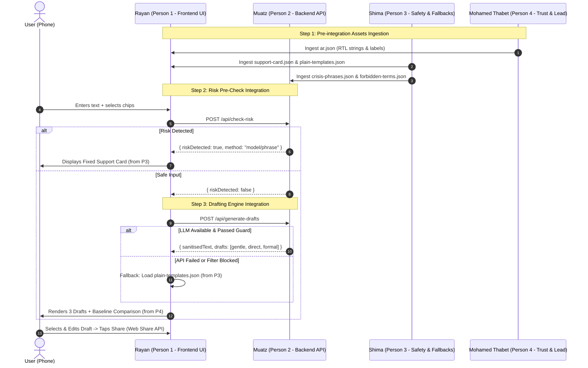

# 🧪 Joint Integration & Testing Protocol

> **Purpose**: Practical guide for connecting the 4 workstreams, validating end-to-end functionality, executing safety benchmarks, and conducting demo rehearsals.

---

## 1. Joint Handoff & Integration Sequence

Do not attempt to connect everything at the last minute. Follow this staged integration protocol:



---

## 2. Component Integration Checkpoints & Verification Tests

### Checkpoint A: Backend & API Readiness (Hour 6.0)
Muatz (Person 2) and Shima (Person 3) verify the API using standard shell/curl commands before Rayan (Person 1) hooks it into the UI.

#### Test A1: Risk Check Endpoint Verification
```bash
# 1. Test normal safe message
curl -X POST "http://localhost:3000/api/check-risk" \
  -H "Content-Type: application/json" \
  -d '{"text": "عندي ضغط كبير من قراية الامتحانات", "chips": ["exams"]}'

# Expected response:
# {"riskDetected": false, "method": "none"}

# 2. Test Libyan dialect crisis phrase (should trigger keyword or model)
curl -X POST "http://localhost:3000/api/check-risk" \
  -H "Content-Type: application/json" \
  -d '{"text": "خلاص ما نقدر نكمل ونبي نموت", "chips": ["other"]}'

# Expected response:
# {"riskDetected": true, "method": "phrase"} (or "model"/"both")
```

#### Test A2: Draft Generation & Sanitization Verification
```bash
curl -X POST "http://localhost:3000/api/generate-drafts" \
  -H "Content-Type: application/json" \
  -d '{
    "text": "بابا ديما يضغط عليا في قرايتي ورقمي 0912345678",
    "chips": ["exams", "family"],
    "recipient": "friend"
  }'

# Expected response:
# {
#   "sanitisedText": "[name] ديما يضغط عليا في قرايتي ورقمي [phone]",
#   "identifiersRemoved": [{"original": "بابا", "placeholder": "[name]"}, ...],
#   "drafts": [
#     {"tone": "gentle", "text": "..."},
#     {"tone": "direct", "text": "..."},
#     {"tone": "formal", "text": "..."}
#   ],
#   "outputCheckPassed": true,
#   "usedFallbackTemplate": false
# }
```

---

### Checkpoint B: Mobile App & Safety Integration (Hour 8.0)
Rayan (Person 1) and Shima (Person 3) verify mobile app behavior and fallback mechanisms on an actual device or simulator.

#### Test B1: Persistent Human Route Button
1. Open the mobile app on any screen (Home, Chip Selector, Draft View, Edit View).
2. Look for the persistent button labeled **"تكلم مع حد توا"** / "Talk to Someone Now".
3. Tap it: It must immediately open the Fixed Support Card modal without loading indicators or network delay.
4. Verify all phone numbers/links shown are verified or contain the explicit disclaimer: *"لا نستطيع عرض رقم لم نتحقق منه"*.

#### Test B2: Graceful Fallback (Phone Airplane Mode / Network Down)
1. Turn on **Airplane Mode** on the mobile phone (or shut down backend API).
2. Complete chip selection and tap generate draft.
3. **Pass Criteria**: The mobile app must NOT crash or display a generic error. It must automatically render the 3 plain pre-written templates from `plain-templates.json` with a notice: *"تم استخدام نموذج جاهز لعدم توفر الاتصال"*.

#### Test B3: Zero-Transmission Verification for Private Record
1. Turn on Private Record in app settings -> Select 5 chips over multiple simulated sessions -> Trigger one-click "Delete all data".
2. **Pass Criteria**: Zero network requests must be initiated. All storage operations remain solely in sandboxed mobile storage (`AsyncStorage` / `SecureStore`).

#### Test B4: Native Sharing Verification
1. On the Draft Screen, select a draft and tap **مشاركة** (Share).
2. **Pass Criteria**: The native Android / iOS system share sheet pops up, offering to share the drafted message into WhatsApp, Messenger, or Telegram.

---

## 3. Safety Metric Calculation Protocol (Shima [Person 3] + Muatz [Person 2])

Evaluators at Ai4LY expect measured data, not unsupported assertions. Shima (Person 3) executes the synthetic test set:

### Formulae:
$$\text{Recall} = \frac{\text{True Positives (Detected Crisis)}}{\text{True Positives} + \text{False Negatives (Missed Crisis)}}$$

$$\text{False-Alarm Rate} = \frac{\text{False Positives (Benign Flagged)}}{\text{True Negatives (Benign Passed)} + \text{False Positives}}$$

### Benchmark Execution Script:
Shima (Person 3) runs a validation runner (or node script):
```javascript
// safety/evaluate.js
const fs = require('fs');
const testSet = JSON.parse(fs.readFileSync('./safety/test-set.json', 'utf8'));

// Iterate test inputs against check-risk logic
let tp = 0, fn = 0, tn = 0, fp = 0;

for (const sample of testSet) {
  const isCrisis = sample.label === 'crisis';
  const detected = runRiskCheck(sample.text); // local phrase + model check
  
  if (isCrisis && detected) tp++;
  if (isCrisis && !detected) fn++;
  if (!isCrisis && !detected) tn++;
  if (!isCrisis && detected) fp++;
}

console.log(`Test Set Size: ${testSet.length}`);
console.log(`Recall (Crisis Catch Rate): ${((tp / (tp + fn)) * 100).toFixed(1)}% (${tp}/${tp+fn})`);
console.log(`False Alarm Rate: ${((fp / (tn + fp)) * 100).toFixed(1)}% (${fp}/${tn+fp})`);
```
*Note: Our product prioritizes high recall over low false alarms. We explicitly state: "A false alarm displays a harmless support card; a false negative risks a human life."*

---

## 4. Rehearsal & Live Demo Protocol (Hour 11.0)

Evaluators give about 5 minutes presentation + 5 minutes Q&A.

### 5-Minute Pitch Rehearsal Breakdown

| Minute | Slide / Action | Key Speaking Points |
|---|---|---|
| **0:00 – 1:00** | **Slide 1: Problem** | Silence at the first sentence due to stigma & overwhelm. Not clinical illness, but everyday pressure (exams, family, work) in Libyan youth. |
| **1:00 – 2:00** | **Slide 2: Solution** | Jisr (Bridge Note): AI-assisted writing companion. Helps write the *first message to a real human* already in their life, then gets out of the way. |
| **2:00 – 3:30** | **Slide 3 & Live Demo** | **Live Walkthrough**: Select "الامتحانات" (Exams) -> Same-session invitation appears -> Enter 1 dialect sentence -> Guardian Layer checks risk -> 3 tone drafts generated -> Show Baseline Comparison (AI vs Template) -> One-click share. |
| **3:30 – 4:15** | **Slide 4: Safety & Privacy** | Stateless drafting (zero retention), identifier removal, Guardian Layer with measured recall numbers, persistent human route. No diagnosis, no medical claims. |
| **4:15 – 5:00** | **Slide 5: Applicability in Libya** | Built for Libyan Arabic & dialect, zero-account, lightweight, respects family-centric communication. Honest limitations stated. |

### Emergency Contingency Runbook
- **If the live network fails during the presentation**:
  Immediately switch screen share to the **pre-recorded backup demo video** created by Mohamed Thabet (Person 4) at Hour 10. Do not spend time troubleshooting Wi-Fi or API tokens in front of the committee.
